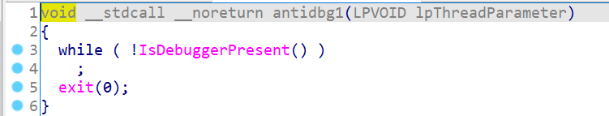
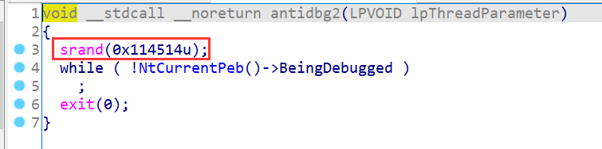
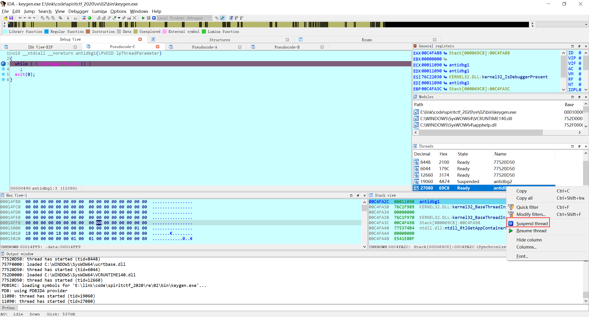
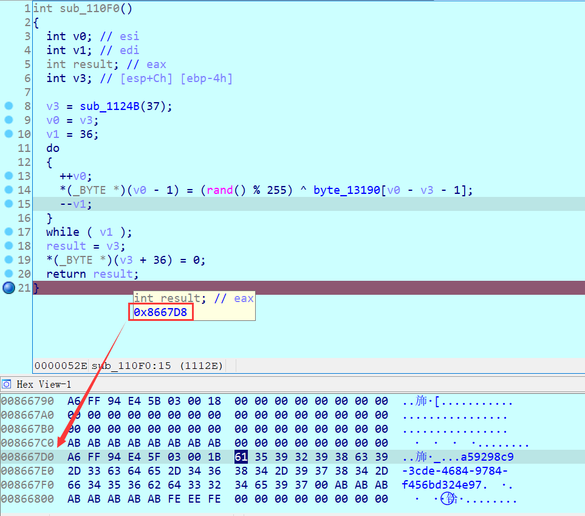
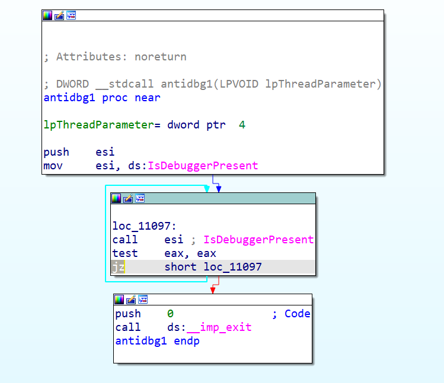
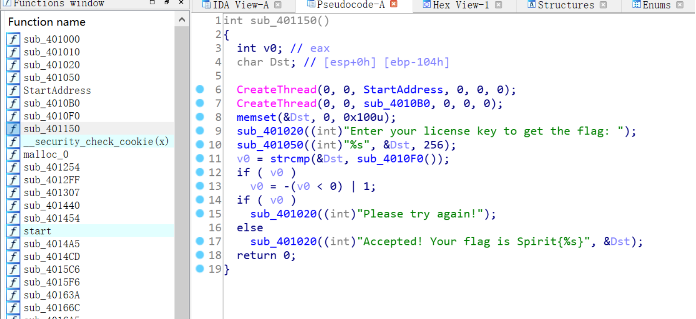
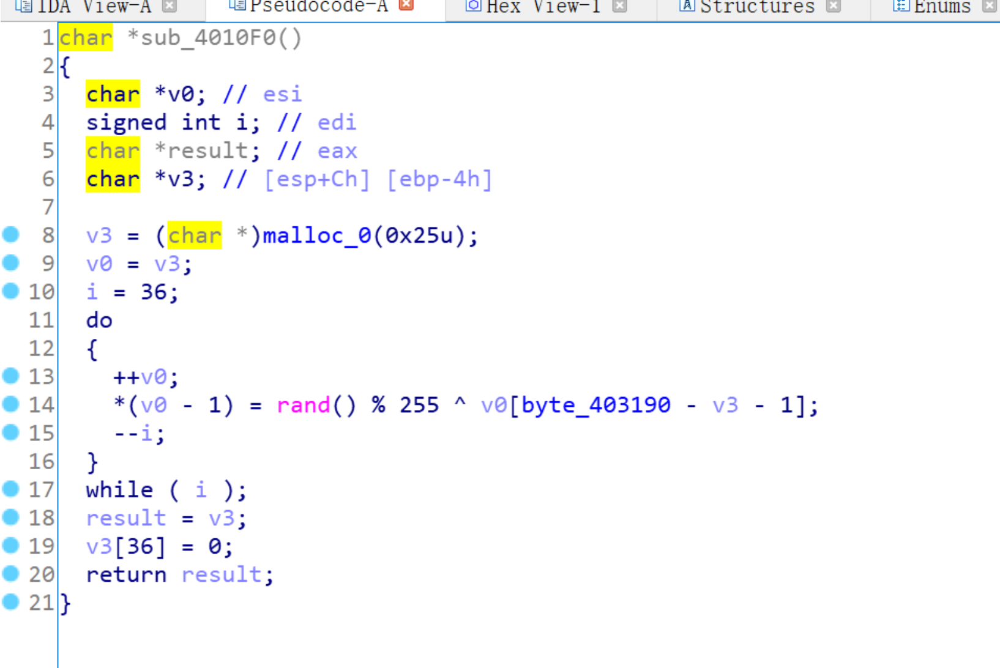
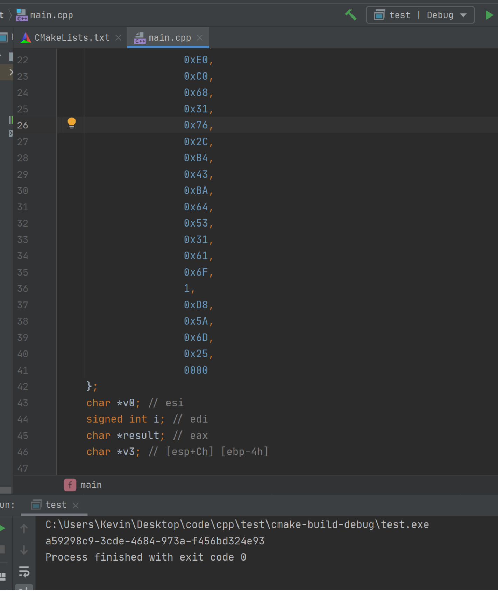

## Keygen

这题目的是为了考察动态调试及patch程序的能力。

主函数处一开始就调用了两个CreateThread，第一个只是单纯的检测`IsDebuggerPresent()`，第二个通过检测[`PEB->BeingDebugged`](https://zh.wikipedia.org/wiki/进程环境块)来判定是否有debugger。



但是注意到第二个反调试中有个`srand()`，这里是故意把srand放在这里混淆视听的。在下文生成flag的时候会用到`rand()`，所以不能直接把这个函数删掉。

### 做法1:动态调试
在两个反调试函数的入口处，和生成flag的函数`sub_110f0()`中下断点。在断点命中两个反调试线程后，将其suspend

随后在程序运行到计算flag的函数结尾时，即可在内存对应的位置找到flag。


### 做法2:Patch程序
改掉两个反调试函数对应的汇编，把检测条件反过来，`jz`改成`jnz`，即可让程序在“没有检测到调试器的时候退出”。之后就可以按照方法1的姿势从内存拿flag了。


### 做法3:照抄算法
以下来自"kkk.kkk.kkk"队的wp
> 丢进ida，f5找到入口函数:
> 
> 发现flag就是`sub_4010F0`的返回值
> 
> 将 `sub_4010F0` 的函数及数据重新运行:
> ```C++
>#include <cstdio>
>#include <cstdlib>
>int main() {
>    int data[37] = {0x48,
>                    0x5E,
>                    0xEF,
>                    0xD9,
>                    0x15,
>                    0x91,
>                    0x60,
>                    0x18,
>                    0x96,
>                    0xDC,
>                    0x3C,
>                    0x3B,
>                    0x29,
>                    0xD1,
>                    0x24,
>                    0xDA,
>                    0x86,
>                    0xE0,
>                    0xC0,
>                    0x68,
>                    0x31,
>                    0x76,
>                    0x2C,
>                    0xB4,
>                    0x43,
>                    0xBA,
>                    0x64,
>                    0x53,
>                    0x31,
>                    0x61,
>                    0x6F,
>                    1,
>                    0xD8,
>                    0x5A,
>                    0x6D,
>                    0x25,
>                    0000
>    };
>    char *v0; // esi
>    signed int i; // edi
>    char *result; // eax
>    char *v3; // [esp+Ch] [ebp-4h]
>    v3 = (char *) malloc(0x25u);
>    v0 = v3;
>    i = 36;
>    do {
>        ++v0;
>        *(v0 - 1) = rand() % 255 ^ data[v0 - v3 >- 1];
>        --i;
>    } while (i);
>    result = v3;
>    v3[36] = 0;
>// for(inti=0;i<36;i++){
>        printf("%s ", result);
>//    }
>}
>```
>结果：
> 

### 非预期解？！
为什么楼上队伍没有使用`srand`就得到了正确结果呢？出题人表示在比赛后才发现`srand`这货在MSVC是非线程安全的......
> [https://stackoverflow.com/questions/10159728](https://stackoverflow.com/questions/10159728/does-one-need-to-call-srand-c-function-per-thread-or-per-process-to-seed-the-r)

> According to the MSDN documentation on `srand()` (assuming you are using Microsoft's C runtime library), the seed is thread-local, so you need to call `srand()` for each thread that is using `rand()`. Note that this may not be the case in other implementations.