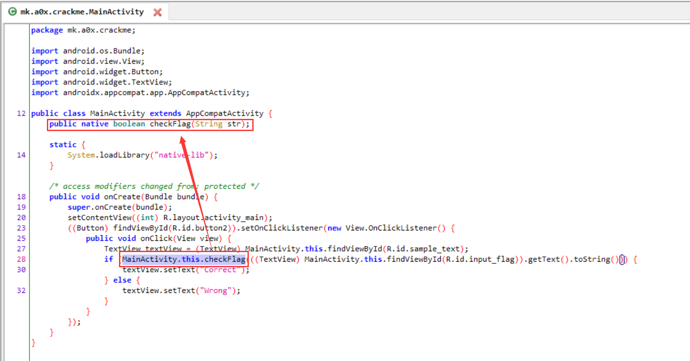
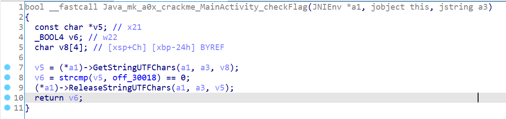
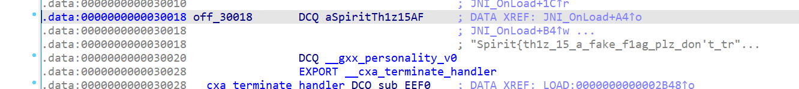
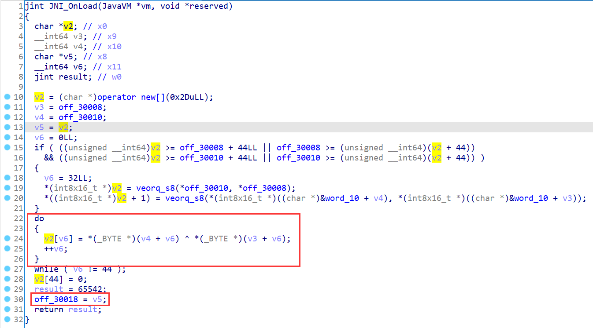
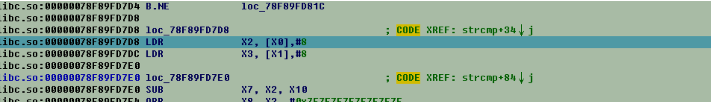
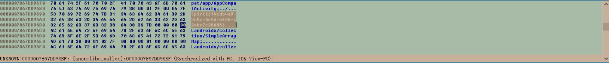

## Crackme
本题为Android逆向。首先把apk丢进jadx，可以很清晰地看出这东西只是调了native的函数判断flag合法性。


随后把so喂给IDA，根据函数名定位到对应的函数，发现这只是个简单的字符串比较。

但是我们点击用于对比的串，发现是个假flag。


如果对Android Native有了解的话，就知道so有几个初始化的地方，包括`.init_array`段、`.fnit_array`段及`JNI_Onload`函数。通过Ctrl+S查看segments可以发现不存在`.init_array`段，并且`.fnit_array`段是空的。我们在`JNI_Onload`可以找到奇怪的操作。

其中`off_30018`为用于flag对比的指针。另外如果在`checkFlag`函数中对着`off_30018`按x找xref也是能找到的。

这函数首先分配了0x2D长的内存，然后在19-20行做了一些无意义的向量操作（因为会被下文的操作覆盖掉），然后将0x30008和0x30010处的两个指针指向的内容异或。于是我们写个简单的Python程序异或下就能得到Flag了。

### 动态调试解法
以下内容来自“很有精神”队的wp。对Android动态调试没有基础的同学参考阅读[这里](https://zhuanlan.zhihu.com/p/58468014)。
> 关键函数checkFlag在so层，同样是动态调试，改android:debuggable="true"，签名安装。
>
> 参考了x84_64下的lib：
> ```C++
> __int64 __usercall > Java_mk_a0x_crackme_MainActivity_checkFlag@<rax>> (__int64
> a1@<rax>, __int64 a2@<rdx>, unsigned int > a3@<ebp>, __int64 a4@<rdi>)
> {
>   __int64 v4; // r14
>   const char *v5; // r15
>   __int64 v7; // [rsp-6h] [rbp-28h]
>   v7 = a1;
>   v4 = a2;
>   v5 = (const char *)(*(__int64 (__fastcall **)> (__int64, __int64, char *))(*
> (_QWORD *)a4 + 1352LL))(
>                        a4,
> a2,
>                        (char *)&v7 + 7);
>   LOBYTE(a3) = strcmp(v5, s2) == 0;
>   (*(void (__fastcall **)(__int64, __int64, > const char *))(*(_QWORD *)a4 +
> 1360LL))(a4, v4, v5);
> return a3; }
> ```
> 关键点在strcmp(v5,s2)，v5即为输入，s2是需要比较的字符串，下断点动态调试，获得flag：
> 
> 